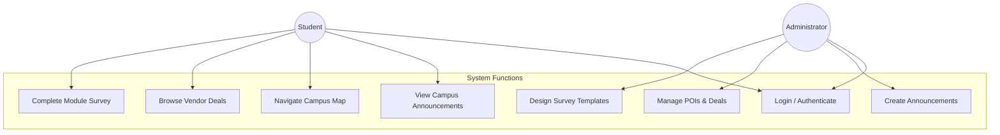
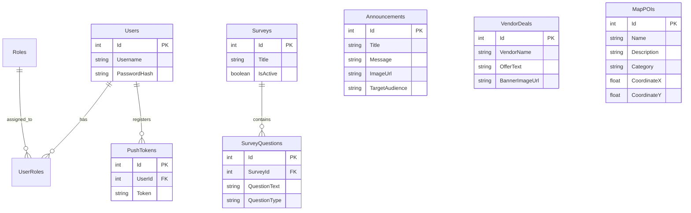
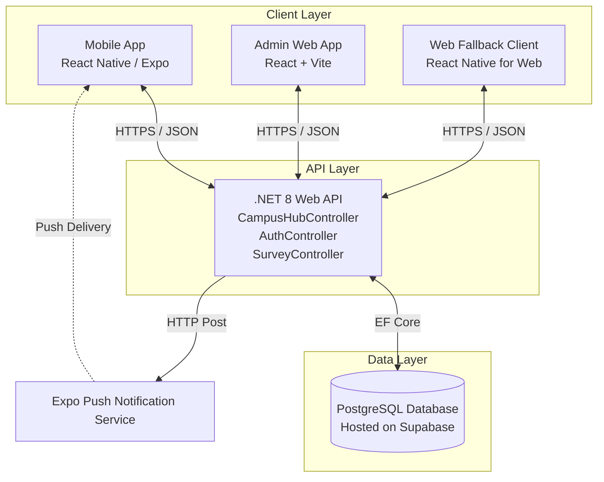

# Software Requirements Specification (SRS) - Olmies Application

## 1. Introduction
### 1.1 Purpose
The purpose of this document is to specify the software requirements for the Olmies application. It covers both the mobile application built for students and the administrative web interface. The core features include a Campus Hub for university announcements, interactive maps, and vendor deals, alongside a comprehensive Survey Engine for academic evaluations.

### 1.2 Scope
Olmies is a cross-platform (iOS, Android, Web) application designed to facilitate campus engagement and academic feedback. The system comprises:
- **Mobile Client**: A React Native (Expo) application for student interaction.
- **Admin Web Dashboard**: A React web application for administrators to manage content and surveys.
- **Backend API**: A .NET Core 8 Web API utilizing Entity Framework Core.
- **Database**: A PostgreSQL relational database hosted on Supabase.

### 1.3 Definitions and Acronyms
- **JWT**: JSON Web Token
- **POI**: Point of Interest (Map markers)
- **UI/UX**: User Interface / User Experience
- **API**: Application Programming Interface
- **SRS**: Software Requirements Specification
- **ER**: Entity-Relationship

## 2. Overall Description
### 2.1 Product Perspective
Olmies is an independent system divided into three main tiers: a centralized database, a backend RESTful API, and dual front-end clients (Mobile Student App and Web Admin Dashboard).

### 2.2 Product Features
- **User Authentication**: Secure JWT-based login and session management based on user roles (Student, Admin).
- **Campus Hub**:
  - Global and targeted push notifications.
  - Interactive campus map with POI details.
  - Dynamically rotating vendor deals carousel.
- **Survey Engine**:
  - Administrative creation and deployment of survey templates.
  - Student interface for completing required module evaluations.
  - Grade unlocking logic contingent on survey completion.
- **Cross-Platform Delivery**: Native mobile experience via bottom tabs, seamless web fallback via a sidebar interface.

### 2.3 User Classes and Characteristics
- **Students**: Mobile app users who consume announcements, navigate the map, view deals, and complete surveys.
- **Administrators**: Web dashboard users who manage users, deploy notifications/deals, and create/analyze surveys.

## 3. System Features
### 3.1 Authentication & Authorization Flow
- **Description**: The system must securely authenticate users and restrict access based on roles.
- **Functional Requirements**:
  - The system shall validate credentials against the Postgres database.
  - The system shall issue a JWT upon successful login.
  - The system shall decode the JWT to determine role-based access (e.g., routing Admins away from the Student Hub).

### 3.2 Push Notifications & Campus Alerts
- **Description**: Admins can construct messages (with or without images) and broadcast them.
- **Functional Requirements**:
  - The mobile device shall register its Expo Push Token with the backend upon login.
  - The Admin UI shall provide a form to create announcements and select target audiences.
  - The Mobile UI shall display a history of alerts, visually differentiating between types (e.g., surveys vs. general info) and displaying thumbnails if images are provided.

### 3.3 Interactive Campus Map
- **Description**: A visual map displaying university buildings and services.
- **Functional Requirements**:
  - The backend shall store POI metadata (Name, Description, Category, Coordinate Layout).
  - The mobile client shall render these POIs using `react-native-maps` native binaries.
  - The web client shall gracefully fallback to an "Optimization" placeholder to prevent bundler crashes.

## 4. Non-Functional Requirements
### 4.1 Performance Requirements
- The API must respond to standard data requests within 500ms.
- The mobile application must maintain a steady 60fps scrolling experience, particularly within the Vendor Deals `FlatList`.

### 4.2 Security Requirements
- All API traffic must be routed over HTTPS.
- Passwords must be hashed before storage in the PostgreSQL database.
- Sensitive routes must be protected by the `[Authorize]` attribute in the .NET backend.

### 4.3 Architecture & Implementation Technologies

**Backend (.NET 8 Web API)**
- **Framework**: ASP.NET Core MVC (Controllers).
- **ORM**: Entity Framework Core with Npgsql (PostgreSQL provider).
- **Authentication**: JWT Bearer Authentication (`Microsoft.AspNetCore.Authentication.JwtBearer`).
- **Push Provider**: Expo Server SDK integration for dispatching Push receipts.
- **CORS Setup**: Allowing specific frontend local host ports and future production domains.

**Database (PostgreSQL on Supabase)**
- **Schema**: Entity Framework Code-First Migrations generate the exact relational schema.
- **User Profiles**: Distinct identities are established for user records, correlating with authentication layers.
- **Geospatial Data**: Map coordinates stored natively as Float values representing layout anchor points. 

**Frontend - Mobile Client (Expo)**
- **Framework**: React Native managed by Expo SDK 52.
- **Navigation**: `@react-navigation/native-stack` for core flows, `@react-navigation/bottom-tabs` for mobile dashboard navigation.
- **Map View**: `react-native-maps` implementing native Apple Maps/Google Maps binaries.
- **Push Reception**: `expo-notifications` handling background/foreground messages.

**Frontend - Web Dashboard (React)**
- **Framework**: React Native for Web (for the mobile fallback) AND standalone Vite React apps tailored for administrative panels.
- **Routing**: Client-side history manipulation.
- **Styling**: Vanilla CSS structure optimized with container components.

## 5. System Models (Diagrams)

### 5.1 Use Case Diagram

### 5.2 Entity-Relationship (ER) Diagram
*(Simplified Core Schema)*

### 5.3 System Architecture Diagram

